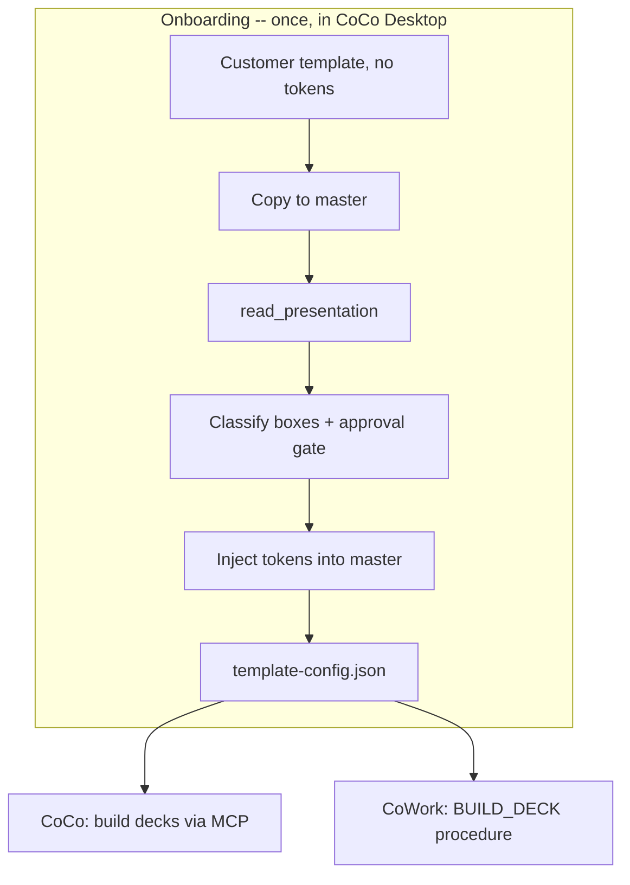

# creacion-google-slides

Generate branded Google Slides decks from **any company template** -- with **no
hardcoded branding**. The first time you use it, the skill onboards the customer's
own template (analyzes it, tokenizes it by context with your approval, and writes a
per-customer catalog). After that, you generate on-brand decks from natural language.

Runs in **Cortex Code Desktop** (via the Google Workspace MCP) and can be deployed to
**Snowflake CoWork** (a Snowpark procedure that calls the Slides API server-side).

## How it works

- The customer's **original is never modified** -- a copy becomes the tokenized master.
- A deterministic Python builder (`scripts/build_payload.py`) handles deletions,
  duplications, reorder, and token replacement, so the agent only drafts content.

## Two onboarding tiers

| Tier | Setup | Gets you |
|------|-------|----------|
| **1 (default)** | Zero manual steps. Uses only the MCP (`read_presentation` + `replaceAllText`). | Full deck generation. No programmatic font-fit/bullets. |
| **2 (optional)** | Run `scripts/extract_catalog.gs` in Apps Script once, paste back. | Adds shape IDs -> automatic font-fit + bullets (full-fidelity tier). |

The same builder handles both: a Tier 1 catalog simply omits the shape map.

## Usage

1. **Onboard** (first run): "onboard my template" -> paste your Google Slides link ->
   approve the proposed box-to-token mapping. Done.
2. **Generate**: "make a 5-slide deck about Q1 results" -> approve the plan -> get a URL.
3. **Deploy to CoWork** (optional): "deploy this to CoWork" -> see
   [cowork/DEPLOY.md](cowork/DEPLOY.md).

## Files

| Path | Purpose |
|------|---------|
| `SKILL.md` | The skill: Onboarding / Generation / Deploy modes. |
| `scripts/build_payload.py` | Config-driven payload builder (structure/fill/tokens/reorder). |
| `scripts/classify_template.py` | Onboarding: analyze a template + build its catalog. |
| `scripts/font_fit.py` | Font-fit math (Tier 2). |
| `scripts/extract_catalog.gs` | Optional Apps Script extractor (Tier 2). |
| `references/content-guide.md` | Neutral content-quality guidance (editable per brand). |
| `cowork/build_deck_proc.py` | Snowpark handler (source of truth) for CoWork. |
| `cowork/setup.sql` | One-shot CoWork deploy (EAI, secret, procedure, MCP server). |
| `cowork/DEPLOY.md` | CoWork admin guide. |

## Requirements

- Google Workspace MCP connected in Cortex Code (`google_workspace_install`).
- Python 3 for the payload builder.
- For CoWork: a Google Cloud service account + the Snowflake objects in `setup.sql`.

> Provided AS IS, with no warranty. Review and test before using. See the repository
> root `DISCLAIMER.md` and `LICENSE`.
