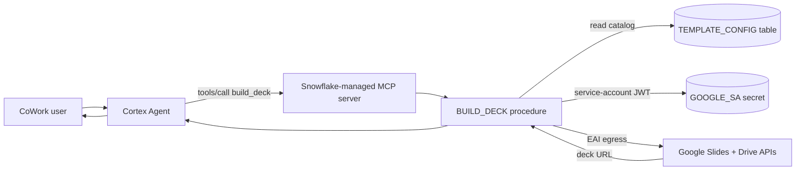

# Deploy `creacion-google-slides` to Snowflake CoWork

CoWork (Snowflake Intelligence) cannot run local Python and has no Google Slides
MCP, so deck generation runs **server-side** as the `BUILD_DECK` stored procedure,
which calls the Google Slides + Drive REST APIs through an External Access
Integration. This guide covers the one-time admin setup.

> Onboarding (analyzing and tokenizing the customer's template) still happens once
> in **Cortex Code Desktop** (Mode A of the skill). CoWork only *generates* decks
> from the catalog that onboarding produced.

## Architecture



## Prerequisites (Google Cloud)

1. Create or pick a Google Cloud project.
2. Enable both **Google Slides API** and **Google Drive API**.
3. Create a **service account**; create a **JSON key** for it.
4. Share the tokenized **master template** (the copy CoCo made during onboarding)
   with the service account's `client_email` as **Editor**. The procedure creates
   each deck as a copy of that master, so the service account must be able to read
   the master and create files.
   - Tip: put the master in a **Shared Drive** the service account is a member of,
     so generated copies have a clear home and sharing is simple.

## Prerequisites (Snowflake)

- A role that can `CREATE INTEGRATION`, `CREATE SECRET`, `CREATE MCP SERVER`
  (ACCOUNTADMIN by default), plus a warehouse.
- CoWork / Cortex Agents enabled on the account.

## Steps

1. **Edit `setup.sql`**: set `deploy_role` and `deploy_wh` at the top.
2. **Run `setup.sql`** (via Snowsight worksheet or `snowflake_sql_execute`). It
   creates the database/schemas, `TEMPLATE_CONFIG` table, network rule, External
   Access Integration, the `GOOGLE_SA` secret (placeholder), the `BUILD_DECK`
   procedure, the `SLIDES_MCP` MCP server, and grants.
3. **Set the real secret** -- replace the placeholder with the full JSON key:
   ```sql
   ALTER SECRET BRANDED_SLIDES.APP.GOOGLE_SA SET
     SECRET_STRING = '<paste the full service-account JSON here>';
   ```
   (Or re-run the `CREATE OR REPLACE SECRET` with the real value. Do **not** commit
   the key to git.)
4. **Upload the catalog** produced during CoCo onboarding:
   ```sql
   INSERT INTO BRANDED_SLIDES.CONFIG.TEMPLATE_CONFIG (TEMPLATE_NAME, CONFIG_JSON)
   SELECT 'Acme Deck', $$<contents of template-config.json>$$;
   ```
   CoCo's **Mode C** does this for you. Make sure `master_template_id` in the JSON
   points to the master that is shared with the service account.
5. **Smoke test**:
   ```sql
   CALL BRANDED_SLIDES.APP.BUILD_DECK(PARSE_JSON('{
     "template_name":"Acme Deck","deck_title":"CoWork test",
     "slides":[{"type":"COVER","fields":{"TITLE":"HELLO"}},{"type":"THANKS","fields":{}}]
   }'));
   ```
   Expect `{"status":"ok","url":"https://docs.google.com/presentation/d/.../edit", ...}`.
6. **Add the MCP server to your agent** (Snowsight: AI & ML > Agents > your agent >
   MCP Connectors / Tools), or in the agent spec:
   ```sql
   ALTER AGENT <db>.<schema>.<agent> ADD MCP_SERVER = 'BRANDED_SLIDES.APP.SLIDES_MCP';
   ```
   CoWork users can then ask the agent to build a deck; it calls `build_deck` and
   returns the URL.

## Package availability

`BUILD_DECK` uses `requests` and `cryptography` from the Snowflake Anaconda channel
(plus `snowflake-snowpark-python`). If your account hasn't accepted the Anaconda
terms, do so once in Snowsight (Admin > Billing & Terms) before running `setup.sql`.

## Troubleshooting

| Symptom | Likely cause / fix |
|---------|--------------------|
| `403` from Drive copy | Master not shared with the service account, or Drive API not enabled. |
| `invalid_grant` minting token | Clock skew or malformed `private_key` in the secret (ensure the `\n` escapes survived). |
| `No catalog for <name>` | No matching row in `TEMPLATE_CONFIG`. Insert the catalog (step 4) and match `template_name`. |
| EAI / egress blocked | Confirm the network rule hosts and that `GOOGLE_SLIDES_EAI` is `ENABLED = TRUE`. |
| Tokens not replaced | The `master_template_id` in the catalog is not the tokenized master. |
| Procedure can't see secret | `SECRETS=('google_sa'=...)` binding name must match `_snowflake.get_generic_secret_string("google_sa")`. |

## Security notes

- The service-account key is a credential. Store it only in the Snowflake SECRET;
  never commit it. Grant `READ` on the secret narrowly.
- The EAI restricts egress to the three Google API hosts only.
- Rotate the key per your policy; re-`ALTER SECRET` to update.
